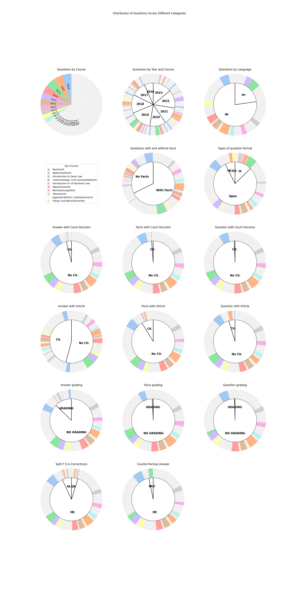

# Swiss Legal Reasoning Dataset
Research collaboration with Joel and the Federal Supreme Court


# About the Dataset




# Setup
On Windows
```
python3.12 -m venv myenv
myenv\Scripts\activate 
python -m pip install -r requirements.txt
```
On MacOs/Linux
```
python3.12 -m venv myenv
source myenv/bin/activate
python -m pip install -r requirements.txt
```

# Run
```
python src/main.py
```